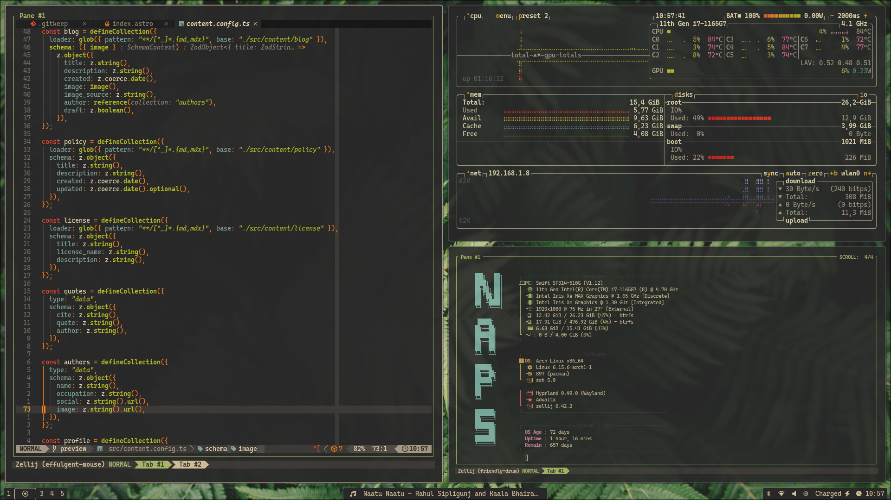

# My dotfiles

- [My dotfiles](#my-dotfiles)
  - [Requirements](#requirements)
    - [Git](#git)
    - [Stow](#stow)
  - [Installation](#installation)

This directory contains the dotfiles for my system, made available under the
[MIT License](./LICENSE) for personal, professional and commercial use without warranty.

## Sneak Peak



## Installation

### Arch Linux

If you want a one to one re-creation of my system, follow the below steps:

1. [Download](https://archlinux.org/download/) the Arch Linux ISO
2. Follow [this guide](https://wiki.archlinux.org/title/USB_flash_installation_medium#Inadvisable_methods) to create a USB flash installation medium
3. Boot into the installation medium and follow [this guide](https://manuals.omamix.org/2/the-omarchy-manual/50/getting-started) to install Arch Linux
4. After installation, execute the script mentioned in the above guide, or displayed [here](https://omarchy.org/)
5. Clone the dotfiles repo in your $HOME directory using git, as shown below

```sh
git clone https://github.com/DrInfinite/dotfiles.git ~/dotfiles --depth 1
cd ~/dotfiles
```

6. Then use GNU stow to create the symlinks

```sh
stow .
```
