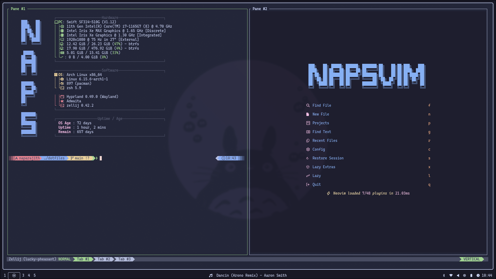

# My dotfiles

<!--toc:start-->

- [My dotfiles](#my-dotfiles)
  - [Sneak Peak](#sneak-peak)
  - [Installation](#installation)
    - [Omarchy ISO](#omarchy-iso)
    - [archinstall Script (Manual)](#archinstall-script-manual)

<!--toc:end-->

This directory contains the dotfiles for my system, made available under the
[MIT License](./LICENSE) for personal, professional and commercial use without warranty.

## Sneak Peak

## Installation

### Omarchy ISO

If you want the simplest way to adopt my config, follow the below steps:

1. Follow [this guide](https://manuals.omamix.org/2/the-omarchy-manual/50/getting-started)
   to download the Omarchy ISO and create a bootable USB.
2. Install Arch Linux with the Omarchy wrapper.
3. Clone the dotfiles repo in your $HOME directory using git.
4. Then use [GNU stow](https://www.gnu.org/software/stow/) to create the symlinks

### archinstall Script (Manual)

If you want a one to one re-creation of my system, follow the below steps:

1. Follow [this guide]()
   to download the Arch Linux ISO and create a bootable USB.
2. Boot into the ISO and execute the `archinstall` script
