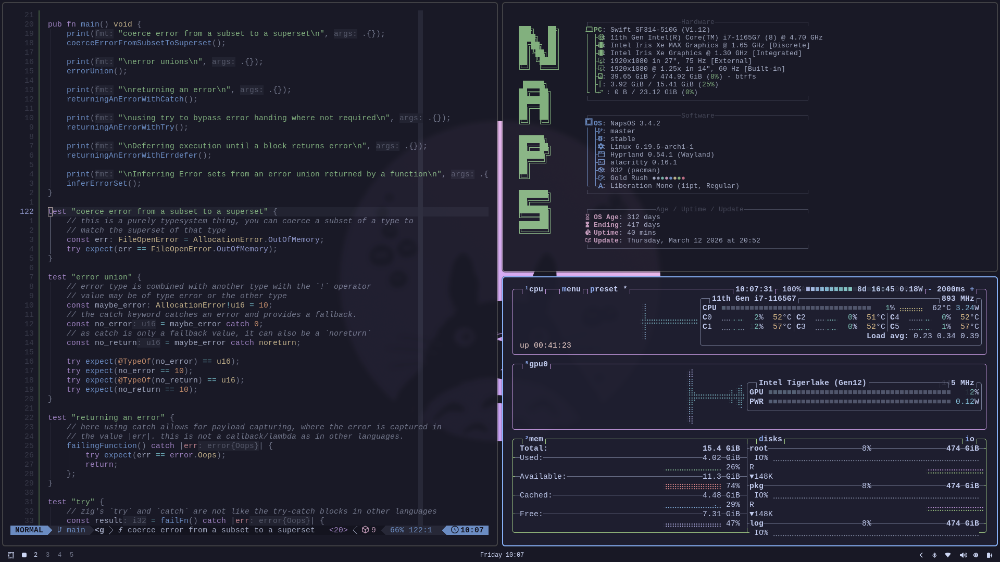
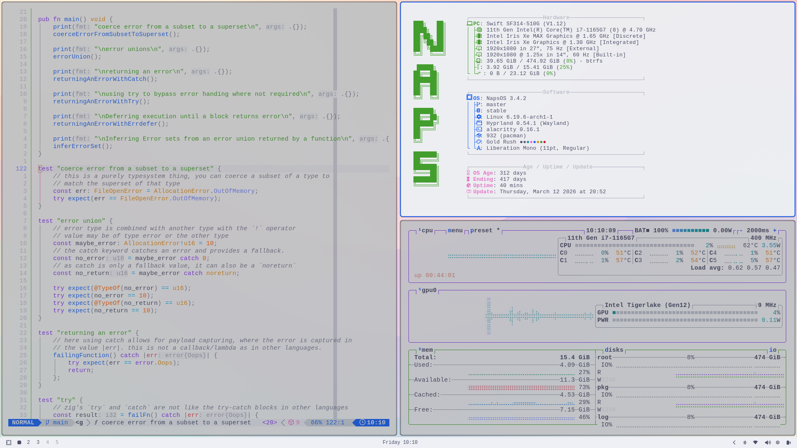
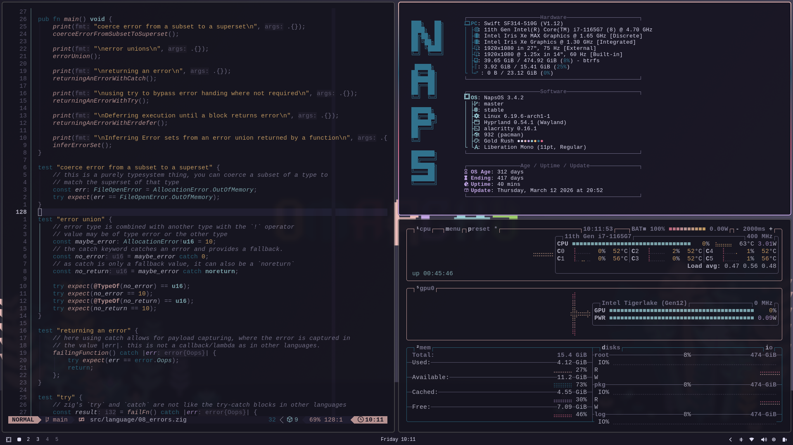
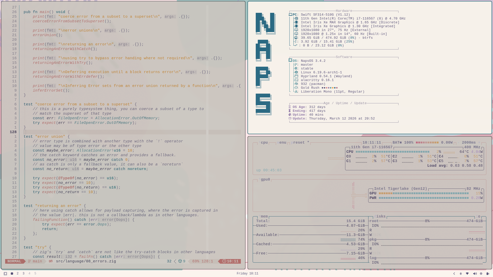

# My dotfiles

<!--toc:start-->

- [My dotfiles](#my-dotfiles)
  - [Sneak Peak](#sneak-peak)
    - [Catppuccin](#catppuccin)
      - [Catppuccin Mocha](#catppuccin-mocha)
      - [Catppuccin Latte](#catppuccin-latte)
    - [Rosepine](#rosepine)
      - [Rosepine (Base)](#rosepine-base)
      - [Rosepine Dawn](#rosepine-dawn)
  - [Installation](#installation)
    - [Omarchy ISO](#omarchy-iso)
    - [archinstall Script (Manual)](#archinstall-script-manual)

<!--toc:end-->

This directory contains the dotfiles for my system, made available under the
[MIT License](./LICENSE) for personal, professional and commercial use without warranty.

## Sneak Peak

### Catppuccin

#### Catppuccin Mocha

#### Catppuccin Latte

### Rosepine

#### Rosepine (Base)

#### Rosepine Dawn

## Installation

### Omarchy ISO

If you want the simplest way to adopt my config, follow the below steps:

1. Follow [this guide](https://manuals.omamix.org/2/the-omarchy-manual/50/getting-started)
   to download the Omarchy ISO and create a bootable USB.
2. Install Arch Linux with the Omarchy wrapper.
3. Clone the dotfiles repo in your $HOME directory using git.
4. Then use [GNU stow](https://www.gnu.org/software/stow/) to create the symlinks

### archinstall Script (Manual)

If you want a one to one re-creation of my system, follow the below steps:

1. Follow [this guide](https://learn.omacom.io/2/the-omarchy-manual/96/manual-installation)
   to download the Arch Linux ISO and create a bootable USB.
2. Boot into the ISO and execute the `archinstall` script
3. Follow the above guide to install Arch and then setup Omarchy.
4. Clone the dotfiles repo in your $HOME directory using git.
5. Then use [GNU stow](https://www.gnu.org/software/stow/) to create the symlinks
